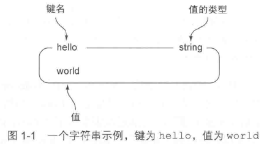

# 初识Redis #

## Redis简介 ##

Redis是一个速度非常快的非关系数据库non-relational database。

- 它可以存储键key与5种不同类型的值value之间的映射；
- 可存储在内存的键值对数据持久化到硬盘；
- 可以使用复制特性来扩展读性能
- 可使用客户端分片来扩展写性能

### Redis与其他数据库和软件的对比 ###

### 附加特性 ###

问题：服务器关闭，存储的数据将何去何从？

Redis有两种不同形式的持久化方法：

1. 时间点转储point-in-time dump
2. 所有修改了数据库的命令都写入一个只追加append-only文件里面

---

为了扩展Redis的读性能，并为Redis提供故障转移failover支持，Redis实现了主从复制特性。

### 使用Redis的理由 ###

Redis的性能和易用性比关系数据库要好得多。

## Redis数据结构简介 ##

Redis可以存储键key与5种不同类型的值value之间的映射

1. STRING
2. LIST
3. SET
4. HASH
5. ZSET

[更多Redis命令](https://redis.io/commands)

[书上的其他代码](https://github.com/josiahcarlson/redis-in-action)

### Redis中的字符串 ###

字符串命令

命令|行为
---|---
GET|获取键对应值
SET|设置键对应值
DEL|删除键值对

	127.0.0.1:6379> set hello world
	OK
	127.0.0.1:6379> get hello
	"world"
	127.0.0.1:6379> del hello
	(integer) 1
	127.0.0.1:6379> get hello
	(nil)
	127.0.0.1:6379>

### Redis中的列表 ###

列表命令

命令|行为
---|---
LPUSH|将元素推入列表的左端
RPUSH|将元素推入列表的右端
LPOP|从列表左端弹出元素
RPOP|从列表右端弹出元素
LINDEX|获取列表在给定位置上的一个元素
LRANGE|获取列表在给定范围上的所有元素

	127.0.0.1:6379> rpush list-key item
	(integer) 1
	127.0.0.1:6379> rpush list-key item2
	(integer) 2
	127.0.0.1:6379> rpush list-key item
	(integer) 3
	127.0.0.1:6379> lrange list-key 0 -1
	1) "item"
	2) "item2"
	3) "item"
	127.0.0.1:6379> lindex list 1
	(nil)
	127.0.0.1:6379> lindex list-key 1
	"item2"
	127.0.0.1:6379> lpop list-key
	"item"
	127.0.0.1:6379> lrange list-key 0 -1
	1) "item2"
	2) "item"
	127.0.0.1:6379>

### Redis的集合 ###

集合命令

命令|行为
---|---
SADD|集合添加元素
SMEMBERS|返回集合所有元素
SISMEMBER|检查给定元素是否存在于集合中
SREM|给定的元素存在于集合中，那么移除这个元素

	127.0.0.1:6379> sadd set-key item
	(integer) 1
	127.0.0.1:6379> sadd set-key item2
	(integer) 1
	127.0.0.1:6379> sadd set-key item3
	(integer) 1
	127.0.0.1:6379> sadd set-key item
	(integer) 0
	127.0.0.1:6379> smembers set-key
	1) "item3"
	2) "item2"
	3) "item"
	127.0.0.1:6379> sismember set-key item4
	(integer) 0
	127.0.0.1:6379> sismember set-key item
	(integer) 1
	127.0.0.1:6379> srem set-key item
	(integer) 1
	127.0.0.1:6379> srem set-key item2
	(integer) 1
	127.0.0.1:6379> smembers ser-key
	(empty list or set)
	127.0.0.1:6379> smembers set-key
	1) "item3"
	127.0.0.1:6379> 

### Redis的散列 ###

散列命令

命令|行为
---|---
HSET|在散列里面关联起给定的键值对
HGET|获取指定散列键的值
HGETALL|获取散列包含的所有键值对
HDEL|如果给定键存在于散列里面，那么移除这个键

	127.0.0.1:6379> hset hash-key sub-key1 value
	(integer) 1
	127.0.0.1:6379> hset hash-key sub-key2 value2
	(integer) 1
	127.0.0.1:6379> hset hash-key sub-key1 value
	(integer) 0
	127.0.0.1:6379> hgetall hash-key
	1) "sub-key1"
	2) "value"
	3) "sub-key2"
	4) "value2"
	127.0.0.1:6379> hdel hash-key sub-key2
	(integer) 1
	127.0.0.1:6379> hdel hash-key sub-key2
	(integer) 0
	127.0.0.1:6379> hget hash-key sub-key1
	"value"
	127.0.0.1:6379> hgetall hash-key
	1) "sub-key1"
	2) "value"
	127.0.0.1:6379>

可将Redis的散列看作是关系数据库里面的行

### Redis的有序集合 ###

有序集合和散列一样，都用于存储键值对；

有序集合的键被称为成员member，每个成员都是各不相同的；

有序集合的值则被称为分值score，分值必须为浮点数；

有序集合是Redis里面唯一一个既可以根据成员访问元素（这点和散列一致），**又可以根据分值以及分值的排列顺序来访问元素的结构**。(键值互射)

有序集合命令

命令|行为
---|---
ZADD|将一个带有给定分值的成员添加到有序集合里面
ZRANGE|根据元素在有序排列中所处在的位置，从有序集合里面获取多个元素
ZRANGEBYSCORE|获取有序集合在给定分值范围内的所有元素
ZREM|若给定成员存在于有序集合，那么移除这个成员

	127.0.0.1:6379> zadd zset-key 728 member1
	(integer) 1
	127.0.0.1:6379> zadd zset-key 982 member0
	(integer) 1
	127.0.0.1:6379> zadd zset-key 982 member0
	(integer) 0
	127.0.0.1:6379> zrange zset-key 0 -1 withscores
	1) "member1"
	2) "728"
	3) "member0"
	4) "982"
	127.0.0.1:6379> zrangebyscore zset-key 0 800 withscores
	1) "member1"
	2) "728"
	127.0.0.1:6379> zrem zset-key member1
	(integer) 1
	127.0.0.1:6379> zrem zset-key member1
	(integer) 0
	127.0.0.1:6379> zrange zset-key 0 -1 withscores
	1) "member0"
	2) "982"
	127.0.0.1:6379>

## 你好Redis ##

如何使用Redis来构建一个简单的文章投票网站

### 对文章进行投票 ###

	//对一篇文章进行投票
    public void articleVote(Jedis conn, String user, String article) {
        long cutoff = (System.currentTimeMillis() / 1000) - ONE_WEEK_IN_SECONDS;

		//判断文章是否已发布超过一周
        if (conn.zscore("time:", article) < cutoff){
            return;
        }

        String articleId = article.substring(article.indexOf(':') + 1);

		//添加已投票用户的集合，添加成功说明用户先前并未投过票
        if (conn.sadd("voted:" + articleId, user) == 1) {

			//增加评分数
            conn.zincrby("score:", VOTE_SCORE, article);

			//增加投票数
            conn.hincrBy(article, "votes", 1);
        }
    }

### 发布并获取文章 ###

    public String postArticle(Jedis conn, String user, String title, String link) {

		//生成一个新的文章ID
        String articleId = String.valueOf(conn.incr("article:"));

		//将发布文章的用户添加到文章的已投票用户名单里面，
		//然后将这个名单的过期时间设置为一周
        String voted = "voted:" + articleId;
        conn.sadd(voted, user);
        conn.expire(voted, ONE_WEEK_IN_SECONDS);

        long now = System.currentTimeMillis() / 1000;
        String article = "article:" + articleId;

		//将文章信息存储到一个散列里面
        HashMap<String,String> articleData = new HashMap<String,String>();
        articleData.put("title", title);
        articleData.put("link", link);
        articleData.put("user", user);
        articleData.put("now", String.valueOf(now));
        articleData.put("votes", "1");
        conn.hmset(article, articleData);

		//将文章添加到根据发布时间排序的有序集合
        conn.zadd("score:", now + VOTE_SCORE, article);

		//根据评分排序的有序集合里面
		conn.zadd("time:", now, article);

        return articleId;
    }

---

	//
    public List<Map<String,String>> getArticles(Jedis conn, int page, String order) {

		//设置获取文章的起始索引和结束索引
        int start = (page - 1) * ARTICLES_PER_PAGE;
        int end = start + ARTICLES_PER_PAGE - 1;

		//获取多个文章ID
        Set<String> ids = conn.zrevrange(order, start, end);

		//根据文章ID获取文章的详细信息
        List<Map<String,String>> articles = new ArrayList<Map<String,String>>();
        for (String id : ids){
            Map<String,String> articleData = conn.hgetAll(id);
            articleData.put("id", id);
            articles.add(articleData);
        }

        return articles;
    }

### 对文章进行分组 ###

    public void addGroups(Jedis conn, String articleId, String[] toAdd) {
        String article = "article:" + articleId;
        for (String group : toAdd) {
            conn.sadd("group:" + group, article);
        }
    }

Redis的ZINTERSTORE命令可以接受多个集合和多个有序集合作为输入，找出所有同时存在于集合和有序集合的成员，并以几种不同的方式来合并这些成员的分值（所有集合成员的分值都会被视为是1）

通过对存储**群组文章的集合**和存储**文章评分的有序集合执行**ZINTERSTORE命令，程序可以得到按照文章评分排序的群组文章；而通过对存储**群组文章的集合**和存储**文章发布时间的有序集合**执行ZINTERSTORE命令，程序则可以得到按照文章发布时间排序的群组文章

    public List<Map<String,String>> getGroupArticles(Jedis conn, String group, int page, String order) {
        String key = order + group;
        if (!conn.exists(key)) {
            ZParams params = new ZParams().aggregate(ZParams.Aggregate.MAX);

			//根据评分或者发布时间，对群组文章进行排序
            conn.zinterstore(key, params, "group:" + group, order);
            conn.expire(key, 60);
        }
        return getArticles(conn, page, key);
    }

>PS.与SQL左链接类似

## 寻求帮助 ##

[官网](https//radis.io)

## 小结 ##

[本章示例源码](Chapter01.java)
