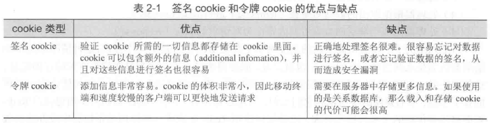

# 使用Redis构建Web应用 #

[1.登录和cookie缓存](#登录和cookie缓存)

[2.使用Redis实现购物车](#使用redis实现购物车)

[3.网页缓存](#网页缓存)

[4.数据行缓存](#数据行缓存)

[5.网页分析](#网页分析)

[6.小结](#小结)

## 登录和cookie缓存 ##

互联网服务会使用cookie来记录我们的身份。

对于用来登录的cookie，有两种常见的方法可以将登录信息存储在cookie里面：

- 签名signed cookie
- 令牌token cookie

选用Token token方式

---

检查登录cookie

	public String checkToken(Jedis conn, String token) {
		return conn.hget("login:", token);
	}

更新令牌的方法

	public void updateToken(Jedis conn, String token, String user, String item) {
		long timestamp = System.currentTimeMillis() / 1000;
		conn.hset("login:", token, user);
		conn.zadd("recent:", timestamp, token);
		if (item != null) {

			//记录用户浏览过的
			conn.zadd("viewed:" + token, timestamp, item);

			//移除旧的记录，只保留用户最近浏览过的25个商品
			conn.zremrangeByRank("viewed:" + token, 0, -26);

		}
	}

清理旧会话程序

	public class CleanSessionsThread extends Thread {
		private Jedis conn;
		private int limit;
		private boolean quit;

		public CleanSessionsThread(int limit) {
			this.conn = new Jedis("localhost");
			this.conn.select(15);
			this.limit = limit;
		}

		public void quit() {
			quit = true;
		}

		public void run() {
			while (!quit) {

				//找出目前已有令牌的数量
				long size = conn.zcard("recent:");

				//令牌数量未超过限制，休眠并在之后重新检查
				if (size <= limit) {
					try {
						sleep(1000);
					} catch (InterruptedException ie) {
						Thread.currentThread().interrupt();
					}
					continue;
				}

				//获取需要移除的令牌ID
				long endIndex = Math.min(size - limit, 100);
				Set<String> tokenSet = conn.zrange("recent:", 0, endIndex - 1);
				String[] tokens = tokenSet.toArray(new String[tokenSet.size()]);

				//为那些将要被删除的令牌构建键名
				ArrayList<String> sessionKeys = new ArrayList<String>();
				for (String token : tokens) {
					sessionKeys.add("viewed:" + token);
				}

				//移除最旧的那些令牌
				conn.del(sessionKeys.toArray(new String[sessionKeys.size()]));
				conn.hdel("login:", tokens);
				conn.zrem("recent:", tokens);
			}
		}
	}

**Redis的过期数据处理**

可以使用Redis的EXPIRE命令，为存储数据设置过期时间，让Redis在一段时间之后自动删除它们。若想即将删除的数据提取有用信息，这方法就并不友好。

## 使用Redis实现购物车 ##

更新购物车

	public void addToCart(Jedis conn, String session, String item, int count) {
		if (count <= 0) {
			conn.hdel("cart:" + session, item);
		} else {
			conn.hset("cart:" + session, item, String.valueOf(count));
		}
	}

在清除旧会话的同时，将旧会话对应用户的购物车也一并删除

	public class CleanFullSessionsThread extends Thread {
		private Jedis conn;
		private int limit;
		private boolean quit;

		public CleanFullSessionsThread(int limit) {
			this.conn = new Jedis("localhost");
			this.conn.select(15);
			this.limit = limit;
		}

		public void quit() {
			quit = true;
		}

		public void run() {
			while (!quit) {
				long size = conn.zcard("recent:");
				if (size <= limit) {
					try {
						sleep(1000);
					} catch (InterruptedException ie) {
						Thread.currentThread().interrupt();
					}
					continue;
				}

				long endIndex = Math.min(size - limit, 100);
				Set<String> sessionSet = conn.zrange("recent:", 0, endIndex - 1);
				String[] sessions = sessionSet.toArray(new String[sessionSet.size()]);

				ArrayList<String> sessionKeys = new ArrayList<String>();
				for (String sess : sessions) {
					sessionKeys.add("viewed:" + sess);
					sessionKeys.add("cart:" + sess);
				}

				conn.del(sessionKeys.toArray(new String[sessionKeys.size()]));
				conn.hdel("login:", sessions);
				conn.zrem("recent:", sessions);
			}
		}
	}

## 网页缓存 ##

减少网站在动态生成内容上面所花的时间，可以降低网站处理相同负载所需的服务器数量，并让网站的速度变得更快。

缓存函数

	public String cacheRequest(Jedis conn, String request, Callback callback) {

		//对于不能被缓存的请求，直接调用回调函数
		if (!canCache(conn, request)) {
			return callback != null ? callback.call(request) : null;
		}

		//
		String pageKey = "cache:" + hashRequest(request);
		String content = conn.get(pageKey);

		if (content == null && callback != null) {

			//如果页面还没有被缓存，那么生成页面
			content = callback.call(request);

			//将生成的页面放到缓存里面
			conn.setex(pageKey, 300, content);
		}

		return content;
	}

## 数据行缓存 ##

为了让缓存函数定期地缓存数据行，程序首先需要将**行ID**和给定的**延迟值**添加到延迟有序集合里面，然后再将**行ID**和**当前时间的时间戳**添加到调度有序集合里面。

	public void scheduleRowCache(Jedis conn, String rowId, int delay) {
		conn.zadd("delay:", delay, rowId);
		conn.zadd("schedule:", System.currentTimeMillis() / 1000, rowId);
	}

---

	public class CacheRowsThread extends Thread {
		private Jedis conn;
		private boolean quit;

		public CacheRowsThread() {
			this.conn = new Jedis("localhost");
			this.conn.select(15);
		}

		public void quit() {
			quit = true;
		}

		public void run() {
			Gson gson = new Gson();
			while (!quit) {

				//尝试获取下一个需要被缓存的数据行以及该行的调度时间戳
				Set<Tuple> range = conn.zrangeWithScores("schedule:", 0, 0);
				Tuple next = range.size() > 0 ? range.iterator().next() : null;
				long now = System.currentTimeMillis() / 1000;
				if (next == null || next.getScore() > now) {
					try {
						//暂时没有行需要被缓存，休眠50ms后重试
						sleep(50);
					} catch (InterruptedException ie) {
						Thread.currentThread().interrupt();
					}
					continue;
				}

				//提前获取下一次调度的延迟时间
				String rowId = next.getElement();
				double delay = conn.zscore("delay:", rowId);
				if (delay <= 0) {
					//不必再缓存这个行，将它从缓存中移除
					conn.zrem("delay:", rowId);
					conn.zrem("schedule:", rowId);
					conn.del("inv:" + rowId);
					continue;
				}

				//读取数据行
				Inventory row = Inventory.get(rowId);

				//更新调度时间并设置缓存值
				conn.zadd("schedule:", now + delay, rowId);
				conn.set("inv:" + rowId, gson.toJson(row));
			}
		}
	}

## 网页分析 ##

网站可以从用户的访问、交互和购买行为中收集到有价值的信息。

更新令牌的方法[登录和cookie缓存](#登录和cookie缓存)

	public void updateToken(Jedis conn, String token, String user, String item) {
		long timestamp = System.currentTimeMillis() / 1000;
		conn.hset("login:", token, user);
		conn.zadd("recent:", timestamp, token);
		if (item != null) {

			//记录用户浏览过的
			conn.zadd("viewed:" + token, timestamp, item);

			//移除旧的记录，只保留用户最近浏览过的25个商品
			conn.zremrangeByRank("viewed:" + token, 0, -26);

			//新增代码
			conn.zincrby("viewed:", -1, item);
		}
	}

**新添加的代码记录了所有商品的浏览器次数**，并根据浏览次数对商品进行了排序（数越小，位置越在前），被浏览得最多的商品将放到有序集合的索引位置上，并且具有整个有序集合最少的分值。

---

判断页面是否需要被缓存

	public boolean canCache(Jedis conn, String request) {
		try {
			URL url = new URL(request);
			HashMap<String, String> params = new HashMap<String, String>();
			if (url.getQuery() != null) {
				for (String param : url.getQuery().split("&")) {
					String[] pair = param.split("=", 2);
					params.put(pair[0], pair.length == 2 ? pair[1] : null);
				}
			}

			String itemId = extractItemId(params);
			if (itemId == null || isDynamic(params)) {
				return false;
			}
			Long rank = conn.zrank("viewed:", itemId);
			return rank != null && rank < 10000;
		} catch (MalformedURLException mue) {
			return false;
		}
	}

## 小结 ##

[本章源码](Chapter02.com)

