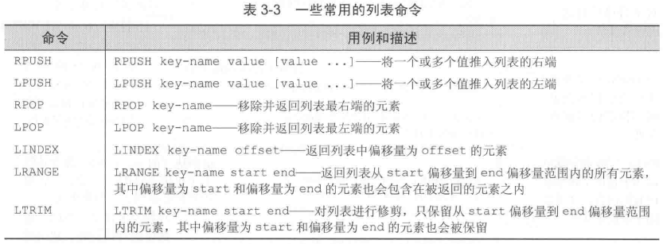

# Redis命令 #

[官方命令文档](https://redis.io/commands)

[1.字符串](#字符串)

[2.列表](#列表)

[3.集合](#集合)

[4.散列](#散列)

[5.有序集合](#有序集合)

[5.1.ZINTERSTORE详细使用说明](#zinterstore详细使用说明)

[5.2.ZUNIONSTORE详细使用说明](#zunionstore详细使用说明)

[6.发布与订阅](#发布与订阅)

[7.其他命令](#其他命令)

[7.1.排序](#排序)

[7.2.基本的Redis事务](#基本的redis事务)

[7.3.键的过期时间](#键的过期时间)

[7.4.小结](#小结)

## 字符串 ##

在Redis里面，字符串可以存储以下3种类型的值：

- 字节串byte string
- 整数
- 浮点数

用户可以通过给定一个任意的数值，对存储着整数或者浮点数的字符串执行自增increment或者decrement

Redis中的自增命令和自减命令

	127.0.0.1:6379> INCR index
	(integer) 1
	127.0.0.1:6379> incr index
	(integer) 2
	127.0.0.1:6379> incrby index 30
	(integer) 32
	127.0.0.1:6379> incrby index 30.203
	(error) ERR value is not an integer or out of range
	127.0.0.1:6379> incrbyfloat index 30.203
	"62.203000000000003"
	127.0.0.1:6379> get index
	"62.203000000000003"
	127.0.0.1:6379> set index 62
	OK
	127.0.0.1:6379> get index
	"62"
	127.0.0.1:6379>

---

供Redis处理子串和二进制位的命令

	127.0.0.1:6379> append str hello
	(integer) 5
	127.0.0.1:6379> append str ,world
	(integer) 11
	127.0.0.1:6379> get str
	"hello,world"
	127.0.0.1:6379> substr str 0 5
	"hello,"
	127.0.0.1:6379> get str
	"hello,world"
	127.0.0.1:6379> getrange str 0 5
	"hello,"
	127.0.0.1:6379> get str
	"hello,world"
	127.0.0.1:6379> setrange str 10 hehe
	(integer) 14
	127.0.0.1:6379> get str
	"hello,worlhehe"
	127.0.0.1:6379> setbit bit 2 1
	(integer) 0
	127.0.0.1:6379> setbit bit 7 1
	(integer) 0
	127.0.0.1:6379> get bit
	"!"
	127.0.0.1:6379>

## 列表 ##

一些常用的列表命令

	127.0.0.1:6379> rpush list last
	(integer) 1
	127.0.0.1:6379> lpush list first
	(integer) 2
	127.0.0.1:6379> rpush list new last
	(integer) 4
	127.0.0.1:6379> rpush list "new last"
	(integer) 5
	127.0.0.1:6379> get list
	(error) WRONGTYPE Operation against a key holding the wrong kind of value
	127.0.0.1:6379> lrange list 0 -1
	1) "first"
	2) "last"
	3) "new"
	4) "last"
	5) "new last"
	127.0.0.1:6379> lpop list
	"first"
	127.0.0.1:6379> lpop list
	"last"
	127.0.0.1:6379> lrange list 0 -1
	1) "new"
	2) "last"
	3) "new last"
	127.0.0.1:6379> rpush list a b c
	(integer) 6
	127.0.0.1:6379> lrange list 0 -1
	1) "new"
	2) "last"
	3) "new last"
	4) "a"
	5) "b"
	6) "c"
	127.0.0.1:6379> ltrim list 2 -1
	OK
	127.0.0.1:6379> lrange list 0 -1
	1) "new last"
	2) "a"
	3) "b"
	4) "c"
	127.0.0.1:6379>

---

阻塞式的列表弹出命令以及在列表之间移动元素的命令

	127.0.0.1:6379> rpush list item1
	(integer) 1
	127.0.0.1:6379> rpush list item2
	(integer) 2
	127.0.0.1:6379> rpush list2 item3
	(integer) 1
	127.0.0.1:6379> brpoplpush list2 list 1
	"item3"
	127.0.0.1:6379> brpoplpush list2 list 1
	(nil)
	(1.01s)
	127.0.0.1:6379> lrange list 0 -1
	1) "item3"
	2) "item1"
	3) "item2"
	127.0.0.1:6379> brpoplpush list list2 1
	"item2"
	127.0.0.1:6379> blpop list list2 1
	1) "list"
	2) "item3"
	127.0.0.1:6379> blpop list list2 1
	1) "list"
	2) "item1"
	127.0.0.1:6379> blpop list list2 1
	1) "list2"
	2) "item2"
	127.0.0.1:6379> blpop list list2 1
	(nil)
	(1.01s)
	127.0.0.1:6379>

## 集合 ##

一些常用的集合命令

	127.0.0.1:6379> sadd set a b c
	(integer) 3
	127.0.0.1:6379> srem set c d
	(integer) 1
	127.0.0.1:6379> srem set c d
	(integer) 0
	127.0.0.1:6379> scard set
	(integer) 2
	127.0.0.1:6379> smembers set
	1) "a"
	2) "b"
	127.0.0.1:6379> smove set set2 a
	(integer) 1
	127.0.0.1:6379> smove set set2 c
	(integer) 0
	127.0.0.1:6379> smembers set2
	1) "a"
	127.0.0.1:6379>

---

用于组合和处理多个集合的Redis命令

	127.0.0.1:6379> sadd skey1 a b c d
	(integer) 4
	127.0.0.1:6379> sadd skey2 c d e f
	(integer) 4
	127.0.0.1:6379> sdiff skey1 skey2
	1) "a"
	2) "b"
	127.0.0.1:6379> sinter skey1 skey2
	1) "d"
	2) "c"
	127.0.0.1:6379> sunion skey1 skey2
	1) "e"
	2) "c"
	3) "d"
	4) "a"
	5) "f"
	6) "b"
	127.0.0.1:6379>

## 散列 ##

一部分常用的散列命令

	127.0.0.1:6379> hmset hash k1 v1 k2 v2 k3 v3
	OK
	127.0.0.1:6379> hmget hash k2 k3
	1) "v2"
	2) "v3"
	127.0.0.1:6379> hlen hash
	(integer) 3
	127.0.0.1:6379> hdel hash k1 k3
	(integer) 2
	127.0.0.1:6379>

---

展示Redis散列的更高级特性

	127.0.0.1:6379> hmset hash2 short hello long 100000000000000
	OK
	127.0.0.1:6379> hkeys hash2
	1) "short"
	2) "long"
	127.0.0.1:6379> hexists hash2 num
	(integer) 0
	127.0.0.1:6379> hincrby hash2 num
	(error) ERR wrong number of arguments for 'hincrby' command
	127.0.0.1:6379> hincrby hash2 num 1
	(integer) 1
	127.0.0.1:6379> hexists hash num
	(integer) 0
	127.0.0.1:6379> hexists hash2 num
	(integer) 1
	127.0.0.1:6379>

## 有序集合 ##

一些常用有序集合命令

	127.0.0.1:6379> zadd zset a 3 b 2 c 1
	(error) ERR value is not a valid float
	127.0.0.1:6379> zadd zser a 3.0 b 2.0 c 1.0
	(error) ERR value is not a valid float
	127.0.0.1:6379> zadd set 1 a 2 b 3 c
	(error) WRONGTYPE Operation against a key holding the wrong kind of value
	127.0.0.1:6379> zadd zset 1 a 2 b 3 c
	(integer) 3
	127.0.0.1:6379> zcard zset
	(integer) 3
	127.0.0.1:6379> zincrby zset 45 c
	"48"
	127.0.0.1:6379> zscore zset b
	"2"
	127.0.0.1:6379> zscore zrank c
	(nil)
	127.0.0.1:6379> zrank zset c
	(integer) 2
	127.0.0.1:6379> zcount zset 0 3
	(integer) 2
	127.0.0.1:6379> zrem zset b
	(integer) 1
	127.0.0.1:6379> zrange zset 0 -1 withscores
	1) "a"
	2) "1"
	3) "c"
	4) "48"
	127.0.0.1:6379>

---

一些非常有用的有序集合命令

REV*表示逆序，就是指元素按照分值从大到小地排列

---

### ZINTERSTORE详细使用说明 ###

[Reference](https://www.w3resource.com/redis/redis-zinterstore-destination-numkeys-key.php)

	#numkeys指key有多少个
	ZINTERSTORE destination numkeys key [key ...]
		[WEIGHTS weight [weight ...]] 
		[AGGREGATE SUM|MIN|MAX]

Redis ZINTERSTORE command is used to compute the **intersection交集** of specified number of input keys sorted sets given by the specified keys, and stores the result in a specified key.

**Return Value：**

Integer reply, the number of elements in the resulting sorted set at the destination.

**Example 1: Redis ZINTERSTORE**

	127.0.0.1:6379> ZADD srcset1 5 M 6 N 7 O
	(integer) 3
	127.0.0.1:6379> ZADD srcset2 3 N 2 O 4 P
	(integer) 3
	127.0.0.1:6379> ZINTERSTORE desset 2 srcset1 srcset2
	(integer) 2
	127.0.0.1:6379> ZRANGE desset 0 -1
	1) "N"
	2) "O"
	127.0.0.1:6379> ZRANGE desset 0 -1 WITHSCORES
	1) "N"
	2) "9"
	3) "O"
	4) "9"

**Example 2: Redis ZINTERSTORE: Using weights**

	127.0.0.1:6379> ZADD srcset1 5 M 6 N 7 O
	(integer) 3
	127.0.0.1:6379> ZADD srcset2 3 N 2 O 4 P
	(integer) 3
	127.0.0.1:6379> ZINTERSTORE desset 2 srcset1 srcset2 WEIGHTS 2 3
	(integer) 2
	127.0.0.1:6379> ZRANGE desset 0 -1 WITHSCORES
	1) "O"
	2) "20"
	3) "N"
	4) "21"

**Example 3: Redis ZINTERSTORE: Using aggregate**

	127.0.0.1:6379> ZADD srcset1 5 M 6 N 7 O
	(integer) 3
	127.0.0.1:6379> ZADD srcset2 3 N 2 O 4 P
	(integer) 3
	127.0.0.1:6379> ZINTERSTORE desset 2 srcset1 srcset2 AGGREGATE MIN
	(integer) 2
	127.0.0.1:6379> ZRANGE desset 0 -1 WITHSCORES
	1) "O"
	2) "2"
	3) "N"
	4) "3"
	127.0.0.1:6379> ZINTERSTORE desset 2 srcset1 srcset2 AGGREGATE MAX
	(integer) 2
	127.0.0.1:6379> ZRANGE desset 0 -1 WITHSCORES
	1) "N"
	2) "6"
	3) "O"
	4) "7"

**Example 4: Redis ZINTERSTORE: union of three sets**

	127.0.0.1:6379> ZADD srcset1 5 M 6 N 7 O
	(integer) 3
	127.0.0.1:6379> ZADD srcset2 3 N 2 O 4 P
	(integer) 3
	127.0.0.1:6379> ZADD srcset3 1 O 2 P 3 Q
	(integer) 3
	127.0.0.1:6379> ZINTERSTORE desset 3 srcset1 srcset2 srcset3
	(integer) 1
	127.0.0.1:6379> ZRANGE desset 0 -1 WITHSCORES
	1) "O"
	2) "10"

### ZUNIONSTORE详细使用说明 ###

[Reference](https://www.w3resource.com/redis/redis-zunionstore-destination-numkeys-key.php)

Redis ZUNIONSTORE command calculates the union of a number of input keys  sorted sets given by the specified keys, and stores the result in a specified key.

The **WEIGHTS** option along with ZUNIONSTORE specify a multiplication factor for each input sorted set. This means that the score of every element in every input sorted set is multiplied by this factor before being passed to the aggregation function. When WEIGHTS is not given, the multiplication factors default to 1.

	ZUNIONSTORE destination numkeys key [key ...] [WEIGHTS weight [weight ...]] [AGGREGATE SUM|MIN|MAX]

**Return Value**

Integer reply, the number of elements in the resulting sorted set at the destination.

**Example 1: Redis ZUNIONSTORE: a new set of union**

	127.0.0.1:6379> ZADD srcset1 5 M 6 N 7 O
	(integer) 3
	127.0.0.1:6379> ZADD srcset2 3 N 2 O 4 P
	(integer) 3
	127.0.0.1:6379> ZUNIONSTORE desset 2 srcset1 srcset2
	(integer) 4
	127.0.0.1:6379> ZRANGE desset 0 -1 WITHSCORES
	1) "P"
	2) "4"
	3) "M"
	4) "5"
	5) "N"
	6) "9"
	7) "O"
	8) "9"

**Example 2: Redis ZUNIONSTORE: Using weights**

	127.0.0.1:6379> ZADD srcset1 5 M 6 N 7 O
	(integer) 3
	127.0.0.1:6379> ZADD srcset2 3 N 2 O 4 P
	(integer) 3
	127.0.0.1:6379> ZUNIONSTORE desset 2 srcset1 srcset2 WEIGHTS 2 3
	(integer) 4
	127.0.0.1:6379> ZRANGE desset 0 -1 WITHSCORES
	1) "M"
	2) "10"
	3) "P"
	4) "12"
	5) "O"
	6) "20"
	7) "N"
	8) "21"

**Example 3: Redis ZUNIONSTORE: Using aggregate**

	127.0.0.1:6379> ZADD srcset1 5 M 6 N 7 O
	(integer) 3
	127.0.0.1:6379> ZADD srcset2 3 N 2 O 4 P
	(integer) 3
	127.0.0.1:6379> ZUNIONSTORE desset 2 srcset1 srcset2 AGGREGATE MIN
	(integer) 4
	127.0.0.1:6379> ZRANGE desset 0 -1 WITHSCORES
	1) "O"
	2) "2"
	3) "N"
	4) "3"
	5) "P"
	6) "4"
	7) "M"
	8) "5"
	127.0.0.1:6379> ZUNIONSTORE desset 2 srcset1 srcset2 AGGREGATE MAX
	(integer) 4
	127.0.0.1:6379> ZRANGE desset 0 -1 WITHSCORES
	1) "P"
	2) "4"
	3) "M"
	4) "5"
	5) "N"
	6) "6"
	7) "O"
	8) "7"

**Example 4: Redis ZUNIONSTORE: union of three sets**

	127.0.0.1:6379> ZADD srcset1 5 M 6 N 7 O
	(integer) 3
	127.0.0.1:6379> ZADD srcset2 3 N 2 O 4 P
	(integer) 3
	127.0.0.1:6379> ZADD srcset3 1 O 2 P 3 Q
	(integer) 3
	127.0.0.1:6379> ZUNIONSTORE desset 3 srcset1 srcset2 srcset3
	(integer) 5
	127.0.0.1:6379> ZRANGE desset 0 -1 WITHSCORES
	 1) "Q"
	 2) "3"
	 3) "M"
	 4) "5"
	 5) "P"
	 6) "6"
	 7) "N"
	 8) "9"
	 9) "O"
	10) "10"

## 发布与订阅 ##

发布与订阅（又称pub/sub）的特点是**订阅者listener**负责订阅**频道channel**，**发送者publisher**负责向频道发送**二进制字符串消息binary string message**

>PS.与观察者模式类比，
>
>订阅者listener - 观察者observer
>
>频道channel & 发送者publisher - 主题subject

---

使用说明

1.打开3个客户端

2.其中2个客户端输入

	127.0.0.1:6379> subscribe redisChat

这两个客户端成为订阅者，订阅名叫redisChat的频道

3.剩下的客户端作发布者

	127.0.0.1:6379> publish redisChat "Redis is a great caching technique"
	(integer) 2
	127.0.0.1:6379> publish redisChat "Hello, World"
	(integer) 2
	127.0.0.1:6379>

2个客户端会输出

	1) "message"
	2) "redisChat"
	3) "Redis is a great caching technique"
	1) "message"
	2) "redisChat"
	3) "Hello, World"

## 其他命令 ##

### 排序 ###

[Reference](https://www.w3resource.com/redis/redis-sort-key.php)

SORT命令用来排序

	SORT key [BY pattern] [LIMIT offset count] [GET pattern [GET pattern ...]] [ASC | DESC] [ALPHA] [STORE destination]

---

按字典序排序

**Example 1 : Redis SORT alpha**

	127.0.0.1:6379> SADD xurl Facebook.com Buddy.com Yahoo.com Youtube.com Example.com
	(integer) 5
	127.0.0.1:6379> SORT xurl alpha
	1) "Buddy.com"
	2) "Example.com"
	3) "Facebook.com"
	4) "Yahoo.com"
	5) "Youtube.com"

**Example 2: Redis SORT alpha desc**

	127.0.0.1:6379> SORT xurl alpha desc
	1) "Youtube.com"
	2) "Yahoo.com"
	3) "Facebook.com"
	4) "Example.com"
	5) "Buddy.com"

---

分页输出

**Example 3: Redis SORT limit offset count**

	127.0.0.1:6379> SORT xurl alpha limit 0 3
	1) "Buddy.com"
	2) "Example.com"
	3) "Facebook.com"
	127.0.0.1:6379> SORT xurl alpha limit 0 10
	1) "Buddy.com"
	2) "Example.com"
	3) "Facebook.com"
	4) "Yahoo.com"
	5) "Youtube.com"
	127.0.0.1:6379> SORT xurl alpha limit 3 10
	1) "Yahoo.com"
	2) "Youtube.com"

---

**Use get option**

If you get used to query the value of the other key

For example, when compared to Google.com and rank-Google.com of xurl to query the value of the use rank-Google.com get rank-*.

**If you are thinking to join in a relational database.**

Enter the web site ranking to prepare data

**Example: Redis SORT rank-* alpha**

	127.0.0.1:6379> MSET rank-Google.com 1 rank-Facebook.com 2 rank-Youtube.com 3 rank-Buddy.com 4 rank-Example.com 5
	OK
	127.0.0.1:6379> SORT xurl get rank-* alpha
	1) "4"
	2) "5"
	3) "2"
	4) "1"
	5) "3"

### 基本的Redis事务 ###

[Reference](https://www.w3resource.com/redis/redis-discard.php)

Redis的基本事务basic transaction需要用到**MULTI命令**和**EXEC命令**，这种事务可以让一个客户端在不被其他客户端打断的情况下执行多个命令。

**和关系数据库那种可以在执行的过程中进行回滚的事务不同**，在Redis里面，被**MULTI命令**和**EXEC命令**包围的所有命令会一个接一个地执行，直到所有命令都执行完毕为止。当一个事务执行完毕之后，Redis才会处理其他客户端的命令。

### 键的过期时间 ###

在使用Redis存储数据的时候，有些数据可能在某个时间点之后就不再有用，用户可使用DEL命令显式删除这些无用数据，也可以通过Redis的过期时间expiration特性来让一个键在给定的时限timeout之后自动被删除。

	127.0.0.1:6379> set key value
	OK
	127.0.0.1:6379> get key
	"value"
	127.0.0.1:6379> expire key 2
	(integer) 1
	127.0.0.1:6379> get key
	(nil)
	127.0.0.1:6379> set key value2
	OK
	127.0.0.1:6379> expire key 60
	(integer) 1
	127.0.0.1:6379> ttl key
	(integer) 52
	127.0.0.1:6379>

### 小结 ###

