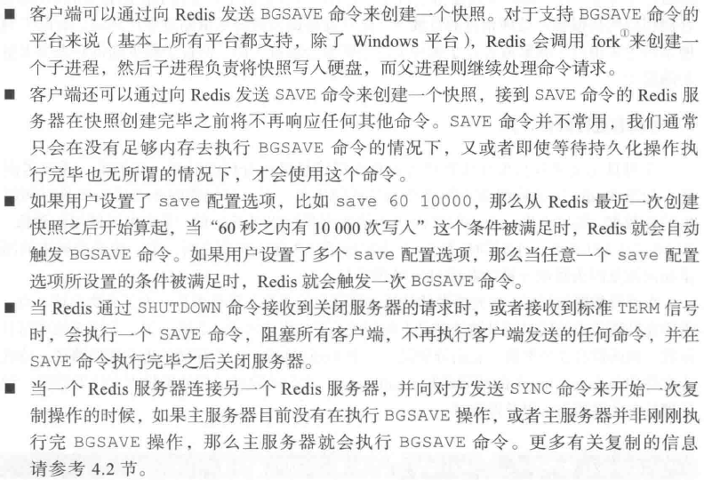

# 数据安全与性能保障 #

## 持久化选项 ##

Redis提供了两种不同的持久化方法来将数据存储在硬盘内：

1. 快照snapshotting 它可将存在于某一时刻的所有数据都写入硬盘里面
2. 只追加文件append-only file 它会在执行写命令时，将执行写命令到硬盘里面

两种持久化方法可同时使用。

---

Redis提供的持久化配置

配置文件所在位置

### 快照持久化 ###

Redis可通过创建快照来获取存储在内存里面的数据在某个时间点上的副本。

在创建快照之后，

- 用户可对快照进行备份
- 可将快照复制到其他服务器从而创建具有相同数据的服务器
- 可将快照留在原地以便重启服务器使用

创建快照的方法

在只使用快照持久化来保存数据时，一定要记住：

如果系统真的发生崩溃，用户将丢失最近一次生成快照之后更改的所有数据。因此，**快照持久化只适用于那些即使丢失一部分数据也不会造成问题的应用程序**。

而不能接受这种数据损失的应用程序则考虑AOF持久化。

使用快照持久化的场景

- 个人开发
- 对日志进行聚合计算
- 大数据

### AOF持久化 ###

简单来说，AOF持久化会将被执行写到AOF文件的末尾，以此来记录数据发生的变化。因此，Redis只要从头到尾重新执行一次AOF文件包含的所有写命令，就可以恢复AOF文件所记录的数据集。

AOF持久化通过配置文件的`appendonly yes`配置选项来打开。

appendfsync选项及同步频率

虽然AOF持久化非常灵活地提供了多种不同的选项满足不同应用程序对数据安全的不同要求，但**AOF持久化也有缺陷**——那就是AOF文件的体积大小。

### 重写/压缩AOF文件 ###

疑惑：AOF持久化既可将丢失数据的时间窗口降低至1秒（甚至不丢失任何数据），又可以在极短时间内完成定期的持久化操作，那么我们有什么理由不使用AOF持久化？

因为

1. AOF可造成使用文件的内存空间急速膨胀；
2. 过大的AOF文件进行数据恢复会耗费大量时间。

---

**解决AOF文件体积不断增大的问题**，用户可向Redis发送BGREWRITEAOF命令，该命令会通过溢出AOF文件中的冗余命令来重写AOF文件，使其体积变得尽可能地小。

可通过auto-aof-rewrite-percentage选项和auto-aof-rewrite-min-size选项来自动执行BGREWRITEAOF命令。

## 复制 ##

复制replication可以让其他服务器拥有一个不断地更新的数据副本，从而使得拥有数据副本的服务器可以用于处理客户端发送的读请求。

关系数据库通常会使用一个主服务器master向多个从服务器slave发送更新，并使用从服务器来处理所有读请求。

Redis也采用了同样的方法来实现自己的复制特性，并将其作扩展性能的一种手段。

### 对Redis的复制相关选项进行配置 ###

保证主服务器正确列出`dir`选项和`dbfilename`选项。文件和路径对于Redis进程必须是可写的writable

若用户在启动Redis服务器的时候，指定了一个包含`slaveof host port`选项的配置文件（或命令），那么Redis服务器（作**从服务器**）将根据该选项给定的IP地址和端口号来连接**主服务器**。

`slaveof no one`让服务器终止服务操作，不再接受主服务的数据更新。

### Redis复制的启动过程 ###

---

警告：Redis不支持主主复制master-master replication

被互相设置为主服务器的两个Redis实例只会持续地占用大量处理器资源并且连续不断地尝试对方进行通信，根据客户端连接的服务器的不同，客户端的请求可能会得到不一致的数据，或者完全得不到数据。

